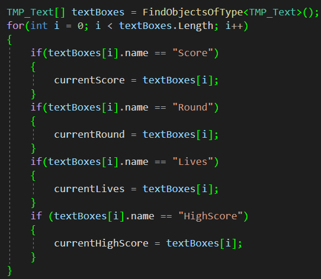

# BurroKong
Repository for my work on the C# and Unity Live Project.  The premise was to design a classic arcade game with a modern feel.  I was responsible for building a Donkey Kong style game for this purpose.  This game took a 2D classic game and was made entirely with 3D objects.  All of the code you will see was researched, but is entirely original.

## Skills Aquired
- Animated actors using both new and legacy animations
- Creating attack system to destroy objects
- Procedural level generation
- Utilizing C# to script movement, AI behavior, collsion events, scene events and level behavior
- Level refresh with score and life carryover utilizing Do Not Destroy on Load
- Creating scoring system utilizing capsule collisions and varied target values
- Implementing a personal High Score script
- Creating respawn system and life counter
- Creating winning and game over conditions and scenes
- Customizing sound effects and background audio
- Collaboration with team utilizing Microsoft Azure DevOps
- Experience working within an Agile/Scrum environment

## Level
Each new level was procedurally generated from an array of prefab pieces.

Depending on what level you are on, the application chooses from a range of specific indecies.  For example, level 1 will only choose the base prefabs, while level 10 can choose from any prefab.  The lower levels seem identical, but the later levels have much variability so that the player is not playing the same game twice.

In this clip you can also see that there is a win condition on level 10, and it sends the player to a game win scene.

## Scenes
There are four main scenes in this game.  The first is the opening scene in which the user is greeted by Burro Kong himself performing a simple haka to ward off the player.  He is accompanied by the controls list, the scoring regime and an entrance button to move to the next scene.

From there the player moves into the main scene which is where the game takes place.  The goal for each level is to reach the princess being guarded by Burro Kong. A capsule collider trigger is what generates the next level.

From the code you can see that level 10 is the highest level and will trigger the winning scene with high score once the reach it.  He is what the process looks like in the first levels.

The final scene is a game over scene that a player reaches if they have either been struck by a barrel or fallen off the map three times.  From here they can either return to the main menu or try again from level one.

## Main Character
The player controlled character has three main actions.  The player can move left and right, jump or attack barrels.  The movement is done by applying force to the Rigidbody on the pawn.  This was done because it was the most efficient way to apply the level of control to both the jump and movement controls. 

### Movement

The asset for the main character is a free asset that was utilized from the Unity Asset Store.  Due to the nature of the project, only free assets were allowed to be used.  I chose this character because he had the best appearance for the aesthetic of the game.  I understand a samurai would never fight an exotic jungle king, but hey, stranger things have happened in video games.  Due to the nature of the asset, it came pre-designed with legacy animations.  This is why his animations are all triggered based upon movements and scripted into him using the playerAnimations.Play() function.  The movement!=Vector3.zero condition and subsequent code were used to control which director the character was facing.  This was done becuase in order to keep the character on the platforms and give the appearance of a 2D game, his transform rotations were locked.

### Attack
What is the point of carrying a sword if you do not intend to use it?  The idea behind the attack feature was implented because I liked the look of the samurai holding the sword.  

To create the attack sequence, I utilized the legacy animation built into the character, then added sounds, as well as a means to only be able to attack when he is standing still.  This was done to avoid the player from simply holding down the attack key and running through the levels as an invicible deity.  This was done using simple booleans that checked for if he was already swinging, if he was jumping or if he was moving.  All three needed to be false (his velocity needed to be almost zero) in order for that action to take place.

In order for the barrels to be destroyed, I created a spherical collider at the tip of the sword and made it a trigger.  Using the booleans of isSwinging and the tag of the projectiles (barrels), the barrels were destroyed once they came within the spherical collider.  I also created a particle system that had the appearance of sparks that would play only if the attack landed on the barrels.

### Death and Respawn
Controlled by the game manager, the player was given three lives in order to complete the game.  The following function handled his death and subsequent respawns.

The "game" object was the game manager that handled the lives, score and round counters.  A bodiless transform was implemented in the game as the general spawn location for the hero, and it was coded into the hero as the public variable "spawner" meaning I could change its spawn location at will.

## Burro Kong
The main protagonist was a simple asset that played an entrance animation on Start() and then made use of the InvokeRepeating() function to spawn barrels and play a simple animation at set intervals.  These intervals were dependent on a throwSpeed variable that was controlled by the game manager script.  The throw speed would increase with each level by .75.  Burro Kong's main program was run in Awake() so that it would begin throwing barrels once the main scene was reloaded.

The barrels were spawned above BK's head and then pushed with an automatic AddForce().  This was because each barrel was given a Rigidbody which served several purposes.  Gravity enacting on the barrels not only gave a realistic motion to the barrels vertically, but it also created the realistic rotation of the barrels so that the player can judge which direction they were going or if they were going to transition to another direction.

## Other Coding Highlights
To control the scoring, round and lives counters and ensure they were constantly updated, I created a simple loop that would iterate between all of the text components looking for the correct Name.  Each text compoenent was given a name since Tags and Layers were not specific enough to each box.  Then, when the currentScore/Round?Lives/HighScore were updated via the game manager, this perpetually running loop would update the values.

To create the high scores, since there was no DB to upload any permanent scores to for this project, a local high score using the PlayerPrefs class was implemented.

Probably the most useful piece of code was implementing a Dont Destroy on Load system.  Each object that needed to carry over into the next level (such as the important game manager) was immediately put into an array and the function DontDestroyOnLoad() was called.

